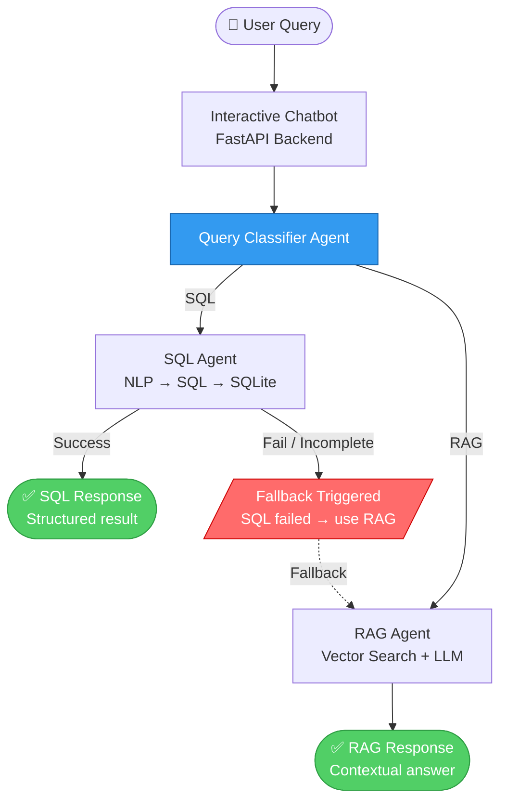
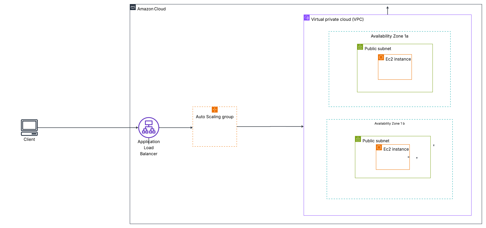
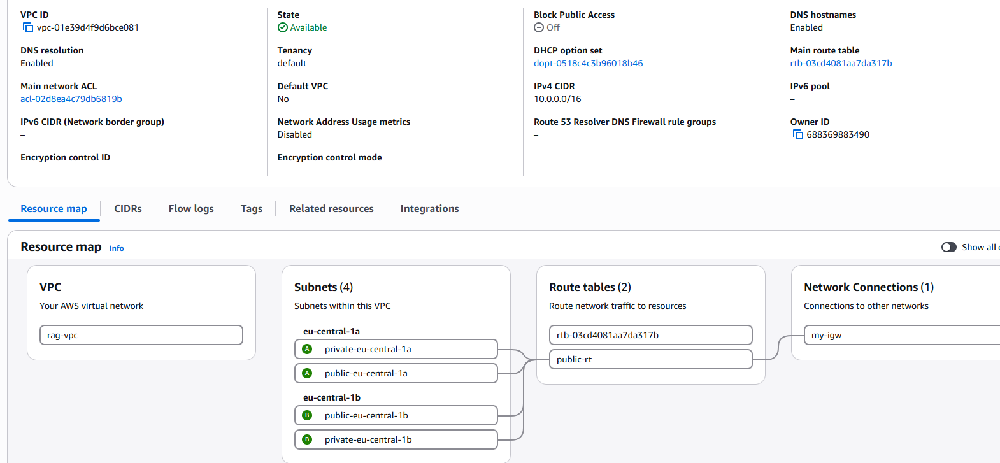
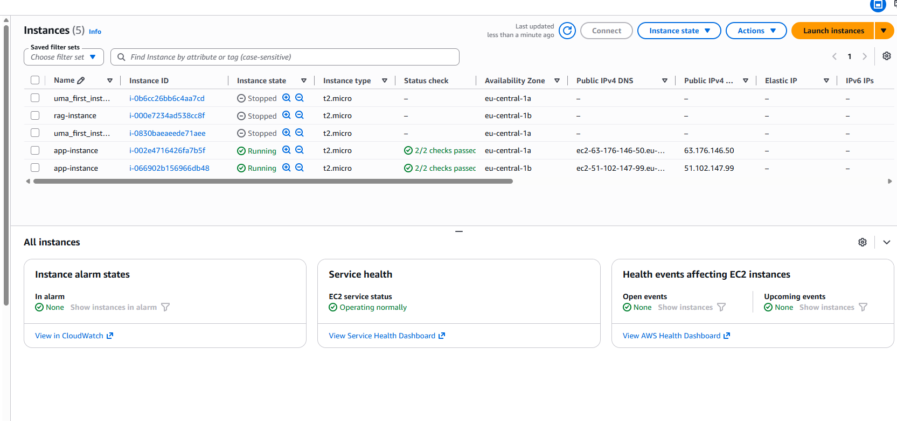
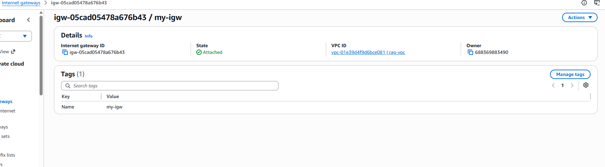
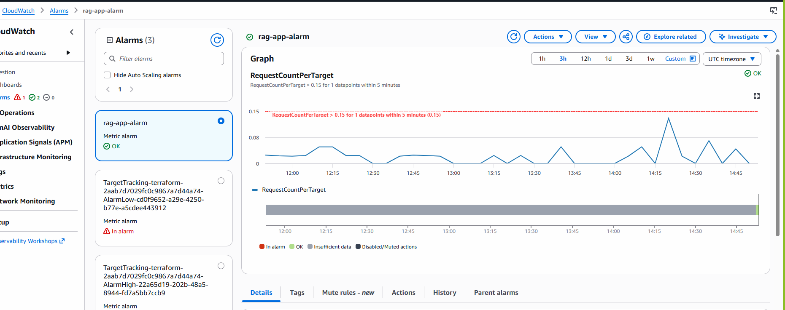
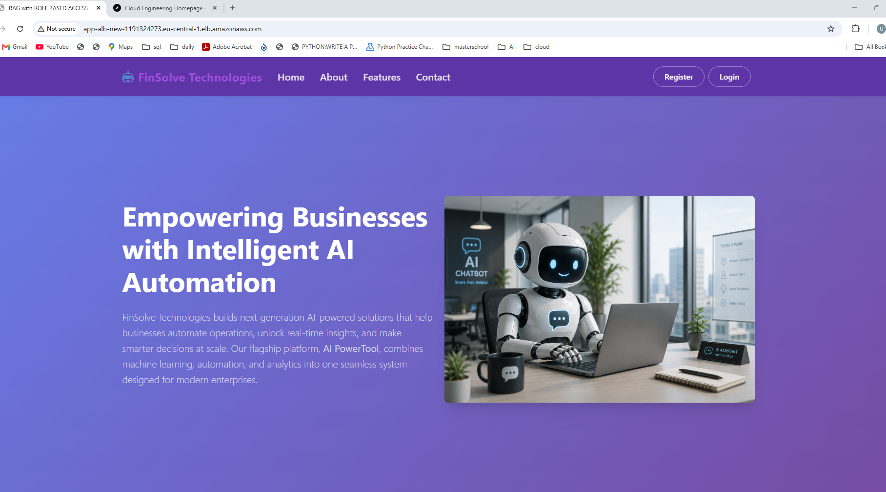
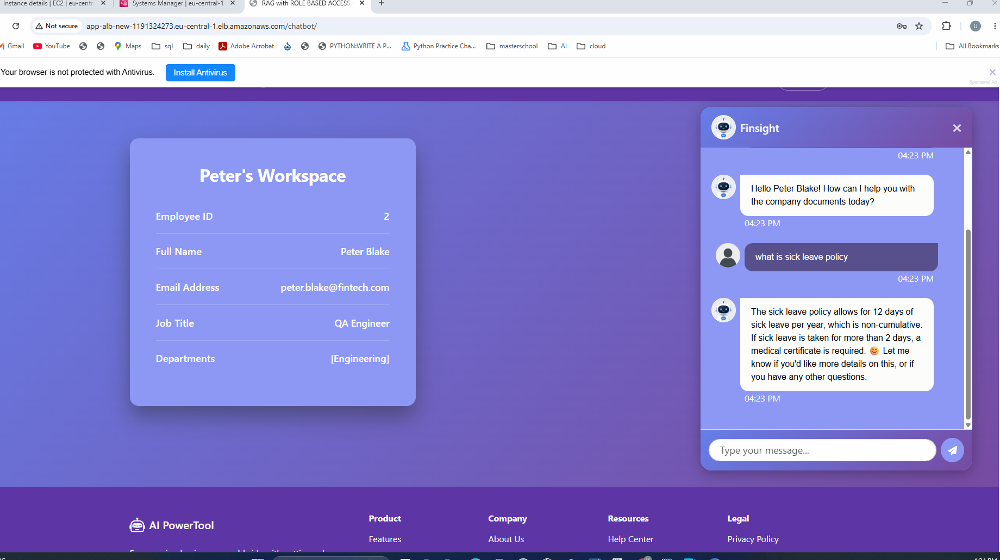
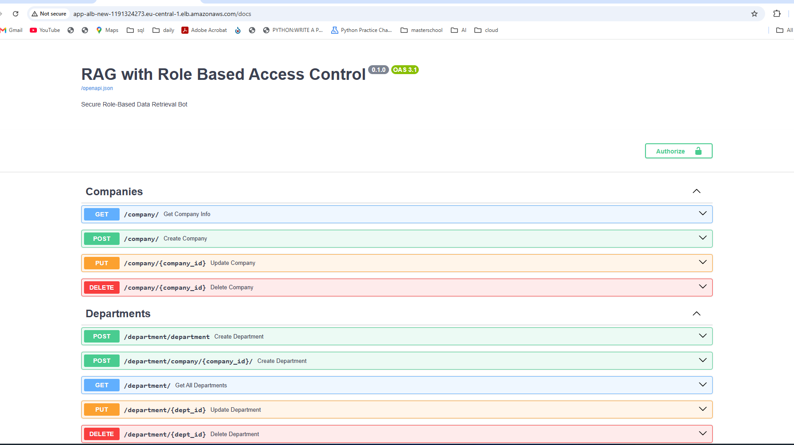

# 🤖 FinSight - AI document assistant - A Role Based Access Control System

FinSight is a secure, intelligent chatbot powered by LLMs + RAG with Role Based Access Control(RBAC) that answers questions from enterprise documents
and ensures employees access only the information aligned with their corporate privileges.

## Table of Contents

- [🧩 Business Problem](#-business-problem)
- [🧠 Solution Overview](#-solution-overview)
- [System Architecture Diagram](#system-architecture-diagram)
- [Architecture Overview](#architecture-overview)
- [Future Enhancements](#7-future-enhancements)
- [Quick Start](#quick-start)
- [Automated AWS Infrastructure Deployment Using Terraform](#automated-aws-infrastructure-deployment-using-terraform)

# 🧩 Business Problem

1. FinSolve Technologies faced operational inefficiencies caused by communication delays and fragmented document access across departments like Finance, Marketing, Engineering , and C-level Executives.
2. Departmental isolation limited timely access to relevant information, slowing decision-making, strategic planning, and project execution.
3. The organization required a secure, role-based AI solution to deliver on-demand, department-specific insights while enforcing strict access controls to maintain data confidentiality and operational efficiency.

# 🧠 Solution Overview

1. To address this issue, an internal AI chatbot was developed using Retrieval Augmented Generation (RAG) and Role-Based Access Control (RBAC).
2. It ensures that every user receives accurate, secure, and role-relevant information instantly.
3. Users can upload documents (Markdown, CSV), and the system retrieves answers based on the user's role.
4. Queries are classified and routed accordingly — SQL-type queries are translated to SQL using an LLM and executed on SQLite,
   while RAG-type queries are answered via the retrieval-augmented generation pipeline, and responses are evaluated for quality.

The architecture includes:

* **FastAPI backend**: for business logic, user management, and RAG handling.
* **HTML & CSS**: a clean, interactive chat interface built with HTML and CSS.
* **LangGraph**: Core orchestration framework used to build stateful, multi-agent workflows for SQL
generation and RAG processing.
* **LangChain**: underlying integration framework utilized for prompt management, chat memory 
and LLM tool calling.
* **SQLite**: Lightweight database used for executing structured SQL queries.
* **RAGAS EVALUATOR**: evaluates responses on metrics like Faithfulness (how grounded the answer 
  is in retrieved context) and Answer Relevancy (how relevant the answer is to the user's question), 
  ensuring trustworthy and high-quality outputs.

# 🚀System Architecture Diagram

# Architecture Overview

* Combines structured data querying (SQL) with unstructured document retrieval (RAG).
* Ensures high accuracy and flexibility by selecting the most appropriate engine per query.
* Implements fallback logic for robustness — the user always gets a meaningful response.
* This system is designed to intelligently respond to user queries using either structured SQL or unstructured RAG depending on the nature of the query.

# End-to-End Flow:

### 1. User Interface Layer
A user enters a question through UI.
This query is sent to the FastAPI backend, which handles the core logic.

### 2. Query Classification
The query first reaches a Query Classifier Agent, which analyzes it and decides:
Is this a structured query? (e.g., about data in a table)
Or an unstructured query? (e.g., asking for procedural guidance)

### 3. SQL Agent Path
If the classifier determines it's an SQL-type query:
The query goes to the SQL Agent, which uses an LLM to convert natural language into SQL.
The generated SQL is executed using SQLite, a lightweight embedded database engine.
If the query executes successfully, the result is sent back to the user as a SQL Response.

### 4. Fallback Mechanism
If the SQL query fails or the response is incomplete, a Fallback Trigger is activated.
The system automatically reroutes the query to the RAG Agent.

### 5. RAG Agent Path
The RAG Agent retrieves relevant information from documents using Vector Search (e.g., via FAISS).
The LLM then generates a coherent answer from the retrieved chunks.
The final RAG-based response is sent back to the user.

### 6. Response Evaluation (RAGAS)
Every response generated by the RAG Agent is evaluated using the RAGAS framework across two key metrics:
- **Faithfulness**: measures whether the answer is factually grounded in the retrieved document chunks, 
  reducing hallucinations.
- **Answer Relevancy**: measures how directly and completely the answer addresses the user's original question.
These scores help maintain response quality and build trust in the system over time.

### 7. Future Enhancements
* Support admin analytics dashboard (e.g., query types, usage).
* Add table+text hybrid retrieval (RAG with tabular fusion).
* Caching of SQL queries for repeated execution.

# Quick Start
### 1. Clone the Repository

https://github.com/Hasireddy/RAG-with-RBAC.git

cd RAG-with-RBAC

### 2. Set Virtual environment

python -m venv myenv

### 3. Activate Virtual environment

myenv/Scripts/activate

### 4. Install Dependencies

pip install -r requirements.txt

### 5. Add your API Keys
Make sure to set your OPENAI_API_KEY in .env file.

### 6. Run the Application

uvicorn app.main:app --reload

Then open your browser and go to:
 http://127.0.0.1:8000

# Automated AWS Infrastructure Deployment Using Terraform

This project demonstrates the deployment of a secure and scalable two-tier web application on AWS using Terraform. 
The infrastructure follows Infrastructure as Code (IaC) principles and includes a custom VPC, public and private subnets 
across two Availability Zones, an Application Load Balancer (ALB), an Auto Scaling Group (ASG), EC2 instances, 
an Internet Gateway,and Amazon CloudWatch. NAT Gateway could not be created due to an explicit organization level service control denial.
So the EC2 instances are deployed in public subnets. The application uses SQLite as its embedded database, 
providing a simple and cost-effective solution for this lightweight project. 
Terraform modules are used to organize the infrastructure, making it reusable, maintainable, and easy to extend.

* **Web/Application Tier**: EC2 instances deployed in public subnets across two Availability Zones, fronted by an Application Load Balancer (ALB). 
An Auto Scaling Group automatically scales the instances based on demand to improve availability and reliability.

* **Database Layer**: The application uses SQLite, an embedded database stored locally on each EC2 instance. 
SQLite was chosen for its simplicity and low cost. As a future enhancement, the database can be migrated 
to Amazon RDS to create a true three-tier architecture.

### 1. Clone repository
git clone https://github.com/Hasireddy/RAG-with-RBAC

cd RAG-with-RBAC

### 2. Create Terraform directory and Configure Terraform variables
Update required values such as AWS region, instance details, key pair, networking, and application-specific settings.

mkdir terraform

cd terraform

vim terraform.tfvars

api_key: Set the value for OPENAI_API_KEY

### 3. Format Terraform files
Run fmt command to fix any syntax error

terraform fmt

### 4. Initialize Terraform
terraform init

### 5. Validate Terraform configuration
terraform validate

### 6. Review deployment plan
Run the following command to see all resources terraform will create and check if matches your expectation.

terraform plan

### 7. Deploy Infrastructure
terraform apply

### 8. Access the Application
After deployment is complete, the web application can be access via the Elastic Load Balancer's DNS name. 
Copy the DNS name Terraform will output and paste it into your web browser.

http://<ALB_DNS_NAME>/

### 9. Confirm Infrastructure
Login to AWS console to confirm all the resources created.

### 10. Terraform Modules
This project uses Terraform modules to organize and manage the infrastructure code effectively.
You can reuse these modules or customize them as needed.

### 11. Architecture Highlights
* Built with Terraform using Infrastructure as Code (IaC)
* Deployed across 2 AWS Availability Zones for high availability
* 2 Public Subnets within a custom VPC
* Application Load Balancer (ALB) to distribute incoming traffic
* Auto Scaling Group (ASG) configured to scale up to 4 EC2 instances
* Internet Gateway for secure public access to the application
* Amazon CloudWatch Alarm checks metrics every 5 minutes and triggers an alert when the threshold exceeds 0.15
* t2.micro EC2 instances selected to provide a cost-effective solution for a lightweight application

### 11. Conclusion
This project demonstrates how Terraform can be used to automate the deployment of a secure, scalable, and highly available AWS infrastructure.
The architecture spans **two Availability Zones**, with **public subnets**, an **Internet Gateway**, and an **Application Load Balancer (ALB)
** to distribute traffic across EC2 instances.

An **Auto Scaling Group** scales the application up to **four EC2 instances** based on demand, while **Amazon CloudWatch** monitors the environment 
every five minutes and triggers an alarm when the configured threshold exceeds **0.15**. To keep costs low for this lightweight application, 
**t2.micro** instances were used.

The application currently uses a **local SQLite database**, which is sufficient for development and demonstration purposes. 
Because SQLite stores data on the individual EC2 instance, it does not provide shared or persistent storage across multiple instances. 
As a future enhancement, the application will be migrated to Amazon RDS to provide a managed, highly available, and scalable database solution.

Overall, this project showcases Infrastructure as Code (IaC) best practices, making the infrastructure reproducible, 
easier to manage, and ready for future expansion.

